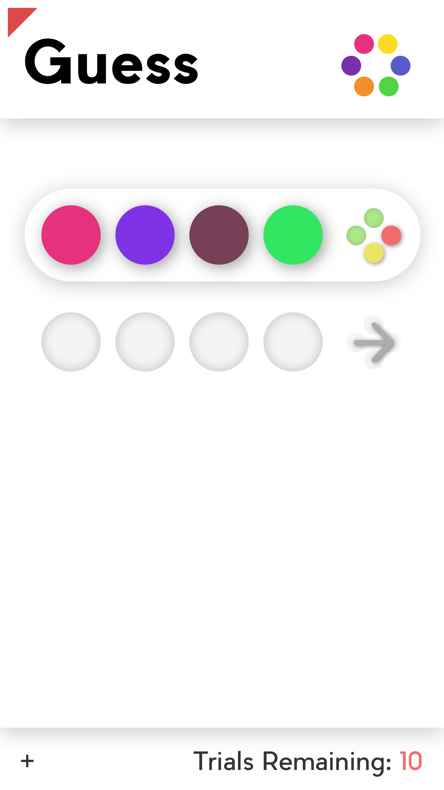

# About the game

It is a reproduction of the simple game *Guess*, being developed using Avalonia UI. Which also means it's cross-platform. 

## Artistic Illustration

> Note this is only a concept, which might differ from the final outcome

## Game Rules

It's the same as the original one:

- Pick 4 balls out of 6 different colors, while the color of balls can be the same. 

- Submit your guess, and observe the feedback:

    - A green indicator means a ball of correct color in the right place
    - A yellow indicator means a ball of correct color in the wrong place
    - A red indicator means the ball does not appear at all

    > Note the position of the indicator is irrelevant

- Make another guesses based on the provided information
- A player has at most 10 trials in a single game